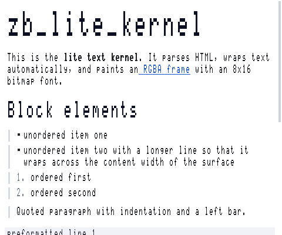
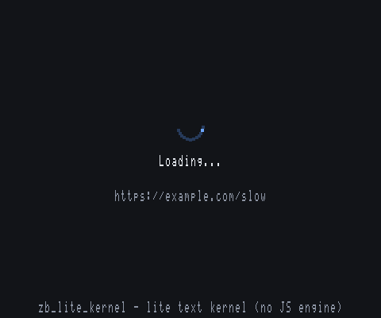

# 轻量文本内核（zb_lite_kernel）设计说明

`zb_lite_kernel`（显示名「轻量文本内核」）是 Zip Browser 的一个**零外部依赖、
软件渲染的原生内核**：它实现 [KERNEL_ABI.md](KERNEL_ABI.md) 的全部 16 个导出符号，
真的去抓网页、解析 HTML、按表面宽度自动换行排版，并用内置点阵字库把结果画到
RGBA 帧缓冲，经 native surface 插件上屏。

它**不是**完整浏览器：没有 JavaScript 引擎、没有 CSS 布局、不解码图片。
它的价值是：在没有任何 WebView 运行时的平台上，仍然提供"能用"的网页阅读能力
（加载、阅读、滚动、点链接、前进后退），并且是学习/验证插件内核 ABI 的完整参考实现。

- 源码：`native_kernels/zb_lite_kernel/`
- 插件包：`example_plugins/lite_kernel/`
- 独立内核包：`build_kernel_pkg/zb_lite_kernel/`
- 自检程序：`native_kernels/zb_lite_kernel/tests/zb_lite_kernel_selftest.c`

实际渲染效果（480×400 帧缓冲直出，未经任何后处理）：





---

## 一、架构分层

```text
┌──────────────────────────────────────────────────────────────┐
│ zb_lite_kernel.c   ABI / 导航历史 / 网络请求 / 输入事件 / eval_js │
│   └── dispatch_from_host 是"输入 + 网络回包"的统一入口          │
├──────────────────────────────────────────────────────────────┤
│ doc.c     fetch/parse：HTML → 文档模型（块 + 行内 run + 锚点）   │
├──────────────────────────────────────────────────────────────┤
│ layout.c  layout：文档模型 → 绘制指令（换行、缩进、列表、pre）    │
├──────────────────────────────────────────────────────────────┤
│ render.c  render：绘制指令 → RGBA8888 帧缓冲（8x16 点阵字库）    │
├──────────────────────────────────────────────────────────────┤
│ json.c    最小 JSON 解析 / 转义（宿主消息、config_json）         │
│ util.c    动态缓冲 / 字符串 / UTF-8 编解码                       │
└──────────────────────────────────────────────────────────────┘
```

| 文件 | 行内职责 |
|---|---|
| `src/zb_lite_util.c` | 可增长缓冲、字符串、UTF-8 编解码、宽字符判定 |
| `src/zb_lite_json.c` | 只读 JSON 解析（arena 分块分配，含 `\uXXXX`/代理对）、JSON 转义 |
| `src/zb_lite_doc.c` | HTML 词法分析 → 块级/行内模型、实体解码、链接区间、锚点 |
| `src/zb_lite_layout.c` | 自动换行、标题缩放、列表前缀、引用缩进、`pre` 不折行、图片占位 |
| `src/zb_lite_render.c` | 主题色、点阵字绘制（加粗/下划线/豆腐块）、滚动条、加载页 |
| `src/zb_lite_kernel.c` | 16 个 ABI 符号、历史栈、`net.fetch`、事件处理、`eval_js` |
| `src/zb_lite_font.h` | 自动生成的 8×16 ASCII 点阵字库（由 `tools/gen_font.py` 生成） |
| `tests/zb_lite_kernel_selftest.c` | 端到端自检（不参与动态库构建） |

**数据流**（一次导航）：

```text
load_url(url)
  ├─ http(s)  → 渲染"加载中"页 → host_dispatch("net.fetch") → 返回
  │              （宿主 tick 期间持续出帧，动画转圈）
  │              宿主回包 → dispatch_from_host({request_id,result})
  │                → 解析 body → 文档模型 → 排版 → 下一帧出内容
  ├─ data:    → 直接解码（支持 base64 与百分号编码）→ 当作 HTML / 纯文本
  └─ 其它     → HTML 直传则解析；像地址则补 https:// 再抓取；否则纯文本页
```

---

## 二、host_dispatch 协议

内核通过 `zb_kernel_create` 拿到的 `host_dispatch(request_id, method, params_json)`
向宿主发起请求，宿主处理后用 `zb_kernel_dispatch_from_host(k, message_json)` 回传。
请求 id 由内核自增分配（从 1 开始）。

### 2.1 `net.fetch`：内核 → 宿主

```c
host_dispatch(request_id, "net.fetch", params_json);
```

`params_json`：

```json
{"url":"https://example.com/page?q=1","method":"GET","max_bytes":2097152}
```

| 字段 | 类型 | 说明 |
|---|---|---|
| `url` | string | **绝对是绝对 URL**（内核已把相对地址解析完） |
| `method` | string | 目前恒为 `"GET"` |
| `max_bytes` | int | 响应体上限，内核取 `2097152`（2 MiB） |

### 2.2 `net.fetch` 的回包：宿主 → 内核

成功：

```json
{
  "request_id": 7,
  "result": {
    "status": 200,
    "final_url": "https://example.com/final",
    "content_type": "text/html; charset=utf-8",
    "body": "<html>…完整响应体的 UTF-8 文本…</html>"
  }
}
```

失败：

```json
{"request_id": 7, "error": "network unreachable"}
```

内核行为：

- `body` 必须是**完整响应体的 UTF-8 文本**（内核不做字节解码，也不认 gzip/分块）；
- `content_type` 含 `text/plain` → 按纯文本排版；含 `html` 或内容像 HTML → 解析 HTML；
- `status >= 400` 且 `body` 为空 → 渲染错误页并把原因写进 `kernel.state.error`；
- `final_url` 会更新当前 URL 与相对链接解析基准，并写回历史条目；
- `request_id` 与内核当前等待的请求不一致时**直接忽略**（典型场景：宿主对
  `kernel.state` 回了 `error`，内核不会把它当成加载失败）。

### 2.3 `kernel.state`：内核 → 宿主（主动上报）

```c
/* 每次导航开始/结束、滚动、点击、按键后上报；宿主未注册该方法会收到
 * {"request_id":N,"error":"no handler: kernel.state"}，内核容错忽略 */
host_dispatch(request_id, "kernel.state", state_json);
```

```json
{
  "url": "https://example.com/final",
  "title": "Example Domain",
  "can_back": true,
  "can_forward": false,
  "loading": false,
  "scroll_y": 0,
  "doc_height": 1234,
  "error": null,
  "kernel": "zb_lite_kernel"
}
```

| 字段 | 类型 | 说明 |
|---|---|---|
| `url` | string | 当前 URL（含 `#fragment`） |
| `title` | string | `<title>` → 首个 `<h1>` → URL 主机名 → `"New Tab"` |
| `can_back` / `can_forward` | bool | 历史栈可用性（与 `go_back/go_forward` 的返回值一致） |
| `loading` | bool | 是否在等 `net.fetch` 回包 |
| `scroll_y` | int | 已钳制到 `[0, doc_height - view_height]` |
| `doc_height` | int | 当前排版下的文档总高度（像素，文档坐标） |
| `error` | string \| null | 加载失败原因（成功为 `null`） |
| `kernel` | string | 恒为 `"zb_lite_kernel"`，便于宿主区分来源 |

---

## 三、输入事件协议（宿主 → 内核）

ABI v1 没有输入符号，输入统一走既有的 `zb_kernel_dispatch_from_host` 通道，
消息里带 `"event"` 字段：

```json
{"event":"pointer","type":"down","x":120,"y":240}
{"event":"pointer","type":"up","x":122,"y":241}
{"event":"pointer","type":"move","x":120,"y":240}
{"event":"scroll","dx":0,"dy":120}
{"event":"key","key":"PageDown"}
{"event":"resize"}
```

| 事件 | 字段 | 内核行为 |
|---|---|---|
| `pointer` | `type` = `down`/`up`/`move`，`x`/`y` 为表面像素坐标 | `down` 记录起点；`up` 与起点距离 ≤ 12px 视为点击，命中链接则导航；`move` 暂无悬停高亮 |
| `scroll` | `dx`（忽略）、`dy`（像素，正数向下） | `scroll_y += dy` 后钳制到 `[0, doc_height - view_height]`，立即重绘并上报状态 |
| `key` | `key` = `Home` / `End` / `PageUp` / `PageDown` / `Up` / `Down`（也接受 `ArrowUp` / `ArrowDown`） | 翻页步长 = `view_height - 40`（最小 20），上下键 48px |
| `resize` | 无 | 标记需要重新排版（宿主改变纹理尺寸后也可直接重新 `attach_surface`） |

坐标约定：`x`/`y` 相对于**当前可见区域左上角**，内核自行加上 `scroll_y`
换算到文档坐标；`attach_surface` 时给的 `width`/`height` 即视口尺寸。

`dispatch_from_host` 的返回值：`0` = 已处理（含"未知事件"这种容错分支），
`-1` = 参数为 NULL 或 JSON 解析失败。宿主可以据此记日志。

---

## 四、导航、历史与 URL 解析

- **历史栈**：固定 32 条，条目为 `{url, html}`（单条缓存的 HTML 上限 1 MiB）；
  新导航会截断"前进"分支，超出容量丢弃最旧的条目。`html == NULL` 表示该条目
  内容尚未取得（等待网络），此时 `go_back/go_forward` 会重新发起 `net.fetch`。
- **返回值**：`load_url` 恒返回 `0`（接受导航，异步完成）；`go_back`/`go_forward`
  在不可用时返回 `-1`，可用时返回 `0`；`reload` 重新抓取当前 URL（`http(s)`）
  或重新解析已缓存内容。
- **地址归一化**：`zb_kernel_load_url` 依次判断——`http(s)://` 直接抓取；
  `data:` 就地解码；内容像 HTML 则直接解析（URL 记为 `about:inline`）；
  `about:` 走内置首页；像域名（含 `.` / `:` / `localhost`）则补 `https://`；
  其余按纯文本页显示。
- **相对地址解析**（`zb_resolve_url`）：支持 `//host/path`、`/abs`、`./rel`、
  `../rel`、`?query`、`#fragment`，以当前 URL 为基准；
  `#fragment` 会优先做**页内跳转**：解析时把 `id` 与 `<a name>` 记入锚点表，
  排版后按锚点所在块的 y 偏移滚动，同时把 `#fragment` 写进 URL 并压入历史。
- **不支持的 scheme**（`javascript:` / `mailto:` / `tel:` / `file:` …）会被忽略，
  `javascript:` 链接点击后不会有任何"假装执行"的行为（诚实降级）。

---

## 五、eval_js 支持的命令

`zb_kernel_eval_js` **不是** JS 引擎，而是一组命令式只读接口，返回 JSON 字符串
（由内核 `malloc`，宿主用 `zb_free_ptr` 释放）。命令前后空白会被忽略。

| 脚本 | 返回 |
|---|---|
| `document.title` | `{"ok":true,"value":"标题"}` |
| `document.body.innerText` | `{"ok":true,"value":"页面纯文本"}`（截断到 8000 字节） |
| `document.links` | `{"ok":true,"value":[{"href":"…","text":"…"}, …],"count":N}` |
| `location.href` | `{"ok":true,"value":"https://…"}` |
| `window.scrollTo(0,N)` / `scrollTo(0,N)` | `{"ok":true,"value":<钳制后的 scroll_y>}` |
| `window.scrollBy(0,N)` / `scrollBy(0,N)` | `{"ok":true,"value":<钳制后的 scroll_y>}` |
| 其它任何脚本 | `{"ok":false,"error":"unsupported script"}` |

> 诚实原则：内核不会"假装执行"任意 JS。宿主若需要真正的脚本能力，应改用
  WebView2 / 系统 WebView 内核。

---

## 六、HTML 支持范围

**块级标签**：`p` `div` `section` `article` `header` `footer` `main` `aside`
`nav` `h1`..`h6` `ul` `ol` `li` `dl` `dt` `dd` `blockquote` `pre` `table`
`thead` `tbody` `tfoot` `tr` `td` `th` `caption` `figure` `figcaption` `form`
`fieldset` `legend` `address` `center` `details` `summary` `hr` `br` `img`

**行内标签**：`a` `b` `strong` `i` `em` `u` `ins` `code` `kbd` `samp` `tt`
`span` `small` `big` `sup` `sub` `mark` `abbr` `cite` `q` `var` `dfn` `time`
`label` `font` `s` `del` `strike` `wbr` `nobr` `bdi` `bdo` `ruby` `data` `output`

**样式表现**：

| 标记 | 表现 |
|---|---|
| `h1` | 3 倍字号；`h2`/`h3` 2 倍；`h4`~`h6` 与正文同号（靠间距区分） |
| `b`/`strong` | 横向重绘一次（加粗） |
| `i`/`em`/`cite`/`var`/`dfn` | 记录为斜体样式（点阵字库无斜体字形，实际与正文同形） |
| `u`/`ins`/`a` | 文字下方画下划线；链接用主题链接色 |
| `code`/`kbd`/`samp`/`tt` | 代码色（等宽本身即点阵字库） |
| `pre` | 不折行、保留空白、右侧裁切，带代码块底色 |
| `ul`/`ol`/`li` | 每级缩进 16px；无序列表画 4×4 方点，有序列表画 `1.` `2.` …（最多 999） |
| `blockquote` | 每级缩进 16px，左侧 3px 竖条 |
| `hr` | 2px 水平线 |
| `img` | 占位框（最多 240×64）+ `alt` 文本（无 `alt` 时用文件名的最后一段） |
| `td`/`th` | 单元格之间插入两个空格分隔（无表格布局） |

**实体**：`&amp; &lt; &gt; &quot; &apos; &nbsp; &#NNN; &#xHH;`，以及
`copy reg trade hellip mdash ndash lsquo rsquo ldquo rdquo bull middot times
divide deg sect para laquo raquo euro pound yen cent plusmn frac12 frac14
ensp emsp thinsp larr uarr rarr darr harr minus infin ne le ge szlig` 等常用命名实体。

**忽略内容**：`<!-- 注释 -->`、`<!DOCTYPE>`、`<?…?>`，以及
`script` `style` `noscript` `svg` `canvas` `template` `iframe` `object` `embed`
`math` `select` `textarea` `video` `audio` `map` 的**内容**（标签本身被跳过）。
`<head>` 内的文本不进正文，但会抓取 `<title>`。

---

## 七、能力边界与已知限制

| 限制 | 说明 |
|---|---|
| **无 JS 引擎** | `script` 内容被丢弃；`eval_js` 只支持第五节列出的命令，其余诚实返回 `ok:false` |
| **无 CSS 布局** | 不支持 `style` 属性 / `<style>` / flex / grid；只有内置的一套排版规则 |
| **无图片解码** | `img` 绘制占位框 + alt 文本，不发起图片请求 |
| **CJK 用占位块** | 非 ASCII 字符（含中文）画 1 像素边框的"豆腐块"，**宽度与换行位置正确**（CJK 占 2 字符格） |
| **字库由 5×7 拉伸而来** | 8×16 字模是把 5×7 点阵纵向二倍取样得到（见 `tools/gen_font.py`），字形偏"粗壮"，但清晰可读 |
| **无表格 / 浮动 / 定位** | 表格退化为普通块，`td/th` 之间用空格分隔 |
| **无 DOM 查询** | 没有 `document.querySelector` 之类的接口 |
| **单线程** | 所有 ABI 调用必须在同一线程（宿主当前就是这么做的），内核内部不加锁 |
| **无字节解码** | `net.fetch` 回传的 `body` 必须是 UTF-8 文本；gzip / 分块 / 字符集转换由宿主负责 |

### 内存与健壮性约定

- 所有返回给宿主的 `const char*`（`name` / `version` / `current_url` / `title` /
  `eval_js`）**每次调用都新分配**，宿主用 `zb_free_ptr` 释放，不存在悬垂指针；
- 所有指针参数都做 NULL 检查；`zb_kernel_*` 在 `k == NULL` 时返回 `-1`（或空串）；
- 所有 `malloc` 失败都有降级路径：解析/排版只丢失内容，不会崩溃；
- HTML 输入上限 4 MiB、绘制指令上限 60000 条、文档高度上限 400000 px、
  链接 4096 个、锚点 4096 个、JSON 节点 400000 个、JSON 嵌套 64 层、
  历史 32 条且每条缓存的 HTML 最多 1 MiB——超限一律"截断 + 继续"，不会 OOM；
- 帧缓冲尺寸变化（再次 `attach_surface`）会重新分配并重排版；尺寸非法
  （≤0 或 >16384）返回负值且不破坏已有状态。

---

## 八、构建

```bat
:: Windows（VS 开发者命令行 / LLVM）
tool\build_lite_kernel.bat
```

```bash
# Linux / Android NDK
sh tool/build_lite_kernel.sh linux
sh tool/build_lite_kernel.sh android-arm64-v8a
sh tool/build_lite_kernel.sh android-armeabi-v7a
sh tool/build_lite_kernel.sh android-x86_64
```

CMake（可选）：

```bash
cmake -S native_kernels/zb_lite_kernel -B build/lite-kernel -DZB_LITE_BUILD_SELFTEST=ON
cmake --build build/lite-kernel
```

产物路径与 `example_plugins/lite_kernel/manifest.json` 的 `kernel.libraries`
一一对应：

```text
example_plugins/lite_kernel/kernels/
├── windows/zb_lite_kernel.dll
├── linux/x86_64/libzb_lite_kernel.so
└── android/{arm64-v8a,armeabi-v7a,x86_64}/libzb_lite_kernel.so
```

打包与安装见 [PLUGIN_KERNEL_GUIDE.md](PLUGIN_KERNEL_GUIDE.md)（插件方式）与
[KERNEL_PACK.md](KERNEL_PACK.md)（`.zbk` 独立内核包方式）。

---

## 九、自检（唯一能证明内核真的工作的手段）

`tests/zb_lite_kernel_selftest.c` 用纯标准 C 直接调用 ABI，覆盖：

1. 16 个符号的存在性与 NULL 参数容错、非法 JSON 容错；
2. `create → load HTML → attach 假 surface → tick`，并**统计帧缓冲里与背景色
   不同的像素数**，确认真的画了东西，且 `stride == width*4`；
3. `net.fetch` 的请求参数（URL / method / max_bytes）、加载中页面、回包解析、
   `final_url` 生效、错误回执容错、失败 → 错误页；
4. 点击链接（扫描命中）、相对地址解析、`#fragment` 锚点跳转；
5. 滚动钳制、`Home/End/PageUp/PageDown`、`kernel.state` 字段完整性；
6. 暗色主题（检查背景像素确实是深色）、畸形 HTML、`data:`（含 base64）、
   5 MiB 超大输入不崩。

运行方式：

```bash
sh tool/build_lite_kernel.sh selftest        # 推荐
# 或手动：
gcc -std=c99 -Wall -Wextra -O2 \
    -I native_plugins/zb_native_surface/include \
    -I native_kernels/zb_lite_kernel/include \
    native_kernels/zb_lite_kernel/src/*.c \
    native_kernels/zb_lite_kernel/tests/zb_lite_kernel_selftest.c \
    -o build/selftest && ./build/selftest
```

退出码 `0` 表示全部断言通过（输出以 `SELFTEST OK` 结尾），非 `0` 表示有失败项，
失败项会逐条打印。当前实现共 106 项断言、全部通过。
